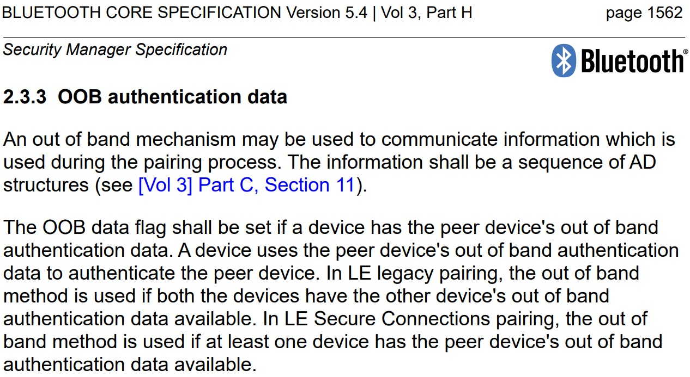

# STM32WB55-p2p-Server-Legacy-OOB-UART

* The STM32WB55-p2p-Server-Legacy-OOB-UART demonstrates the **BLE legacy OOB (Out of Band)** pairing/bonding feature,

  which is similar to [STM32WB55-p2p-Server-OOB-UART](https://github.com/stm32-hotspot/STM32WB55-p2p-Server-OOB-UART) ***LE Secure OOB*** pairing example.
  * This demonstrates the exchange of OOB data between two STM32WB55s using UART.
  * One STM32WB55 BLE Client is used to create the OOB data that will be sent to the BLE Server.
* For more information, check
    *  [PM0271](https://www.st.com/resource/en/programming_manual/pm0271-stm32wb-ble-stack-programming-guidelines-stmicroelectronics.pdf) STM32WB BLE stack programming guidelines
    *  [AN5289](https://www.st.com/resource/en/application_note/dm00598033-building-wireless-applications-with-stm32wb-series-microcontrollers-stmicroelectronics.pdf) Building wireless applications with STM32WB Series microcontrollers
    *  [AN5270](https://www.st.com/resource/en/application_note/an5270-stm32wb-bluetooth-low-energy-wireless-interface-stmicroelectronics.pdf) STM32WB Bluetooth Low Energy wireless interface
    *  [ST Devcon 2019 - Secure Bluetooth Pairing Using NFC](https://www.st.com/content/dam/AME/2019/developers-conference-2019/presentations/STDevCon19_2.5_SecurePairingNFC.pdf)
    * [Bluetooth Core Specification](https://www.bluetooth.com/specifications/specs/?keyword=core+specification) v5 - Out of Band
    * [bluetooth.com Blog](https://www.bluetooth.com/blog/bluetooth-pairing-part-5-legacy-pairing-out-of-band/) : Bluetooth Pairing Part 5:
Legacy Pairing – Out of Band

## Hardware Needed

  * Two [P-NUCLEO-WB55](https://www.st.com/en/evaluation-tools/p-nucleo-wb55.html) boards
    *  One STM32WB55 BLE Client board running [STM32WB55-p2p-Client-Legacy-OOB-UART](https://github.com/stm32-hotspot/STM32WB55-p2p-Client-Legacy-OOB-UART)
    *  One STM32WB55 BLE Server board running [STM32WB55-p2p-Server-Legacy-OOB-UART](https://github.com/stm32-hotspot/STM32WB55-p2p-Server-Legacy-OOB-UART)

## Software Needed

  * Build this project using IAR EWARM v9+ / Keil MDK ARM v5+ / STM32CubeIDE v1.10.0+

## User's Guide

1) [Flash the BLE wireless stack](https://youtu.be/1LvfBC_P6eg) on the P-NUCLEO-WB55 boards. When selecting the wireless stack, check the [Release Notes for STM32WB Copro Wireless Binaries](https://github.com/STMicroelectronics/STM32CubeWB/tree/master/Projects/STM32WB_Copro_Wireless_Binaries/STM32WB5x) whether the selected stack supports **Legacy Pairing**.

    > **Note:** Since this is using BLE Legacy Pairing, both BLE Client and Server **must** use the *CFG_SECURE_NOT_SUPPORTED* option in [app_conf.h](Core/Inc/app_conf.h)

2) Build both [STM32WB55-p2p-Client-Legacy-OOB-UART](https://github.com/stm32-hotspot/STM32WB55-p2p-Client-Legacy-OOB-UART) and [STM32WB55-p2p-Server-Legacy-OOB-UART](https://github.com/stm32-hotspot/STM32WB55-p2p-Server-Legacy-OOB-UART) to flash the application firmware on to each P-NUCLEO-WB55 board.

3) Unpower both P-NUCLEO-WB55 boards and connect the boards using jumpers.

    

    a) Server board PC1 (CN7.30 / LPUART1 TX) = Client board PB7 (JP5 RX / USART1 RX)

    b) Server board PB7 (JP5 RX / USART1 RX)  = Client board PC1 (CN7.30 / LPUART1 TX)

    c) Connect the UART pins and GND.

4) Power both P-NUCLEO-WB55 boards. Use terminal programs like Tera Term to see the logs of each boards via the onboard ST-Link. (115200/8/1/n)

    

5) From the BLE Client side, **press SW1** to send the OOB data via UART. BLE Server also sends data via UART. 

    a) BLE Client sends OOB data (BLE Client address, address type, and a randomly generated 16-byte **Temporary Key TK**) to BLE Server

    b) BLE Server sends BLE Server's address and address type to BLE Client

    c) BLE Client uses BLE Server's address and address type to request BLE connection

    d) After connection and services & characteristic discovery is completed, BLE Client requests OOB pairing
If the OOB TK and BLE address matches, OOB pairing/bonding will be successful.

6) Type the 16-byte TK to a sniffer. For instance, if you have the [Ellisys Bluetooth Analyzer](https://www.ellisys.com/products/btr1/)

    a) The sniffer asks you to type the **Temporary Key (TK)**.
    
    Mouse double-click the red "PIN / TK - Missing" menu.

    

    b) Type the 16-byte TK value from the TeraTerm log message. You only need to fill the TK value.

    

    c) The sniffer can now decrypt the messages

    

    From the BLE Client side, press SW1 to write data to the BLE Server

    From the BLE Server side, press SW1 to notify data to the BLE Client

    Writing or notifying data are captured and decrypted by the sniffer

7) If the Server received an incorrect OOB data for some reason,

  

  OOB pairing / bonding will fail. For instance, if the OOB TK value is different, the *Confirm Value* doesn't match.
  As a result, the BLE Server shows the OOB pairing has failed.
## References

  You can check more details from the [Bluetooth Core Specification](https://www.bluetooth.com/specifications/specs/?keyword=core+specification):

  

  

  

  

  

## Troubleshooting

**Caution** : Issues and the pull-requests are **not supported** to submit problems or suggestions related to the software delivered in this repository. The STM32WB55-p2p-Server-Legacy-OOB-UART example is being delivered as-is, and not necessarily supported by ST.

**For any other question** related to the product, the hardware performance or characteristics, the tools, the environment, you can submit it to the **ST Community** on the STM32 MCUs related [page](https://community.st.com/s/topic/0TO0X000000BSqSWAW/stm32-mcus).